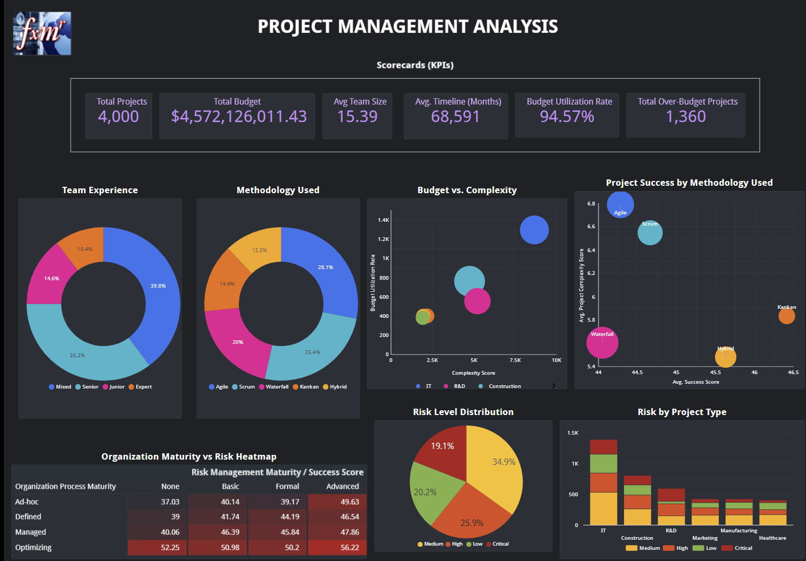
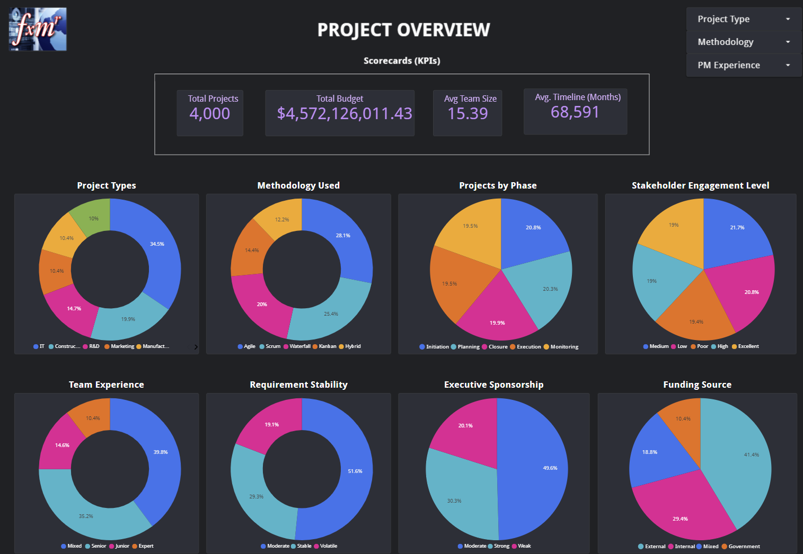
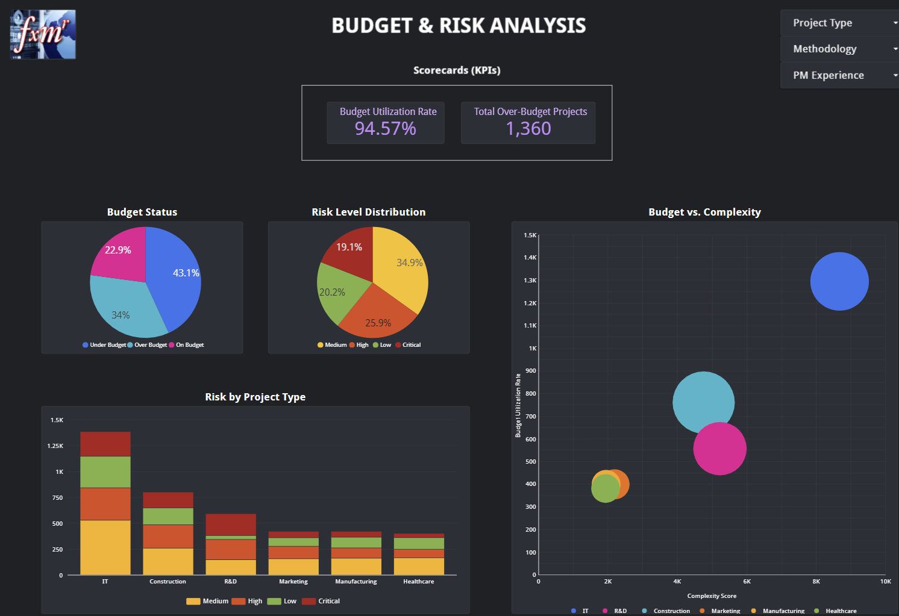
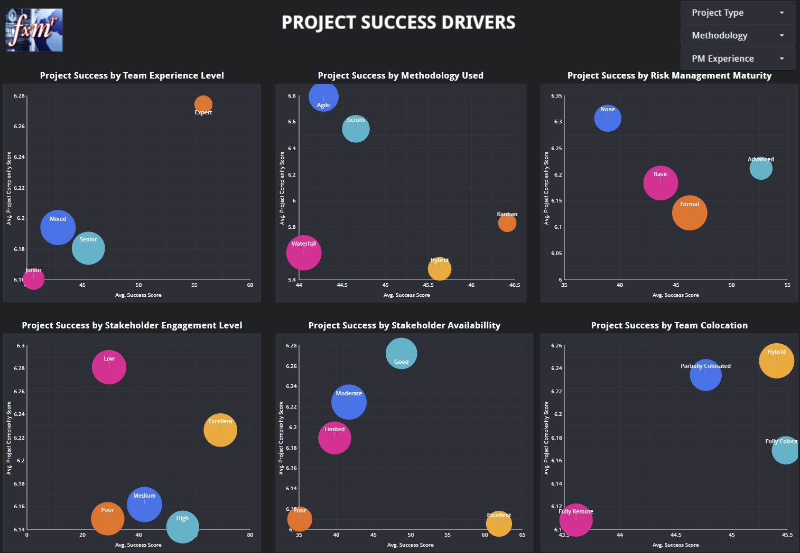
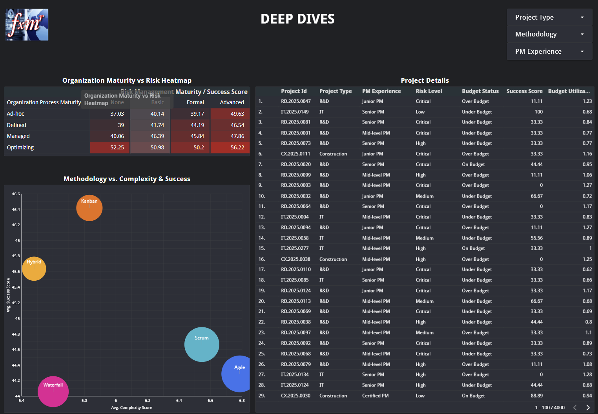

# Project Management Analysis System

A comprehensive analytics platform analyzing 4,000+ enterprise projects with a combined budget of **$4.57 billion**.

This system provides actionable insights for portfolio optimization, risk management, and strategic resource allocation across multiple industries and project methodologies.



## 🎯 Key Metrics

| Metric | Value |
|--------|-------|
| **Total Projects** | 4,000 |
| **Total Budget** | $4,572,126,011.43 |
| **Average Team Size** | 15.39 members |
| **Budget Utilization Rate** | 94.57% |
| **Over-Budget Projects** | 1,360 (34%) |

## 🏗️ Dashboard Architecture

### 1. Project Overview

- **Portfolio Distribution**: 6 industries (IT 34.5%, Construction 19.9%, R&D 14.7%, Marketing 10.4%, Manufacturing 10.4%, Healthcare 10%)
- **Team Experience Mix**: Mixed (39.8%), Senior (35.2%), Junior (14.6%), Expert (10.4%)
- **Methodology Breakdown**: Agile (28.1%), Scrum (25.4%), Waterfall (20%), Kanban (14.4%), Hybrid (12.2%)
- **Project Lifecycle**: Balanced distribution across Initiation, Planning, Execution, Monitoring, and Closure phases (~20% each)



### 2. Budget & Risk Analysis

- **Budget Status Distribution**:
  - Under Budget: 43.1%
  - Over Budget: 34%
  - On Budget: 22.9%
- **Risk Level Distribution**: Medium (34.9%), High (25.9%), Low (20.2%), Critical (19.1%)
- **Industry Complexity Mapping**: Scatter plot correlating budget utilization with complexity scores across all industries



### 3. Project Success Drivers

Analysis of six critical success factors:

- **Team Experience Level**: Expert teams achieve highest success scores (~60) with complexity (~6.28)
- **Methodology Performance**: Agile handles highest complexity (6.6) with success score of 45.8
- **Stakeholder Engagement**: Excellent engagement correlates with complexity 6.3 and success ~55
- **Team Colocation**: Fully colocated teams show optimal performance balance
- **Risk Management Maturity**: Advanced risk management achieves complexity 6.35 with success ~50
- **Stakeholder Availability**: Excellent availability drives highest complexity (6.28) and success (~60)



### 4. Deep Dives

#### Organization Maturity vs Risk Heatmap

Success scores across organizational process maturity and risk management maturity:

| Org Maturity | None | Basic | Formal | Advanced |
|--------------|------|-------|--------|----------|
| **Ad-hoc** | 37.03 | 40.14 | 39.17 | 49.63 |
| **Defined** | 39.00 | 41.74 | 44.19 | 46.54 |
| **Managed** | 40.06 | 46.39 | 45.84 | 47.86 |
| **Optimizing** | 52.25 | 50.98 | 50.2 | 56.22 |



**Key Finding**: Optimizing organizations with Advanced risk management achieve the highest success scores (56.22)

## 📈 Key Insights

### Success Patterns

1. **Methodology Effectiveness**: Agile and Scrum methodologies demonstrate ability to handle higher complexity projects while maintaining competitive success rates

2. **Team Experience Impact**: Expert and mixed experience teams consistently deliver higher success scores across varying complexity levels

3. **Organizational Maturity**: Strong correlation between organizational process maturity and project success, with optimizing organizations outperforming by 34%

### Risk & Budget Correlations

- IT projects dominate portfolio (34.5%) with varied risk distribution across all four levels
- Construction projects show highest proportion of critical and high-risk initiatives
- Budget utilization patterns reveal complexity scores ranging from 0 to 10K+ with diverse utilization rates

### Stakeholder Dynamics

- **Engagement Level**: 21.7% medium, 20.8% low, with room for improvement in high/excellent categories
- **Executive Sponsorship**: Nearly 50% moderate, 30% strong, indicating opportunity for enhanced C-level involvement
- **Requirement Stability**: 51.6% moderate, 29.3% stable, highlighting scope management challenges

## 🔧 Technical Components

### Data Dimensions

- **Project Types**: IT, Construction, R&D, Marketing, Manufacturing, Healthcare
- **Methodologies**: Agile, Scrum, Waterfall, Kanban, Hybrid
- **Experience Levels**: Expert, Senior, Mixed, Junior
- **Risk Levels**: Critical, High, Medium, Low
- **Budget Status**: Under, On, Over Budget

### Interactive Filters

- Project Type selector
- Methodology selector  
- PM Experience level selector

### Visualization Types

- KPI scorecards with percentage breakdowns
- Scatter plots (Budget vs Complexity, Success vs Complexity)
- Stacked bar charts (Risk by Project Type)
- Heatmaps (Organization Maturity vs Risk)
- Donut charts (Distribution metrics)
- Detailed project data table with drill-down capabilities

## 💡 Business Applications

1. **Portfolio Optimization**: Identify high-risk projects early and reallocate resources

2. **Methodology Selection**: Data-driven guidance on optimal methodology based on project complexity

3. **Team Composition**: Evidence-based team building using experience level correlations

4. **Risk Management**: Proactive risk identification across $4.57B portfolio

5. **Budget Forecasting**: Pattern analysis for more accurate budget planning

6. **Organizational Development**: PMO maturity roadmap based on success score correlations

## 📊 Sample Data Structure

```
Project ID | Type | PM Experience | Risk Level | Budget Status | Success Score | Budget Utilization
-----------|------|---------------|------------|---------------|---------------|-------------------
RD.2025.0047 | R&D | Junior PM | Critical | Over Budget | 11.11 | 1.23
IT.2025.0149 | IT | Senior PM | Low | Under Budget | 100 | 0.68
```

## 🚀 Future Enhancements

- [ ] Predictive analytics for project success probability
- [ ] Machine learning models for budget overrun prediction
- [ ] Real-time alerting for risk threshold breaches
- [ ] Automated recommendation engine for methodology selection
- [ ] Integration with project management tools (Jira, MS Project, Asana)
- [ ] Natural language query interface for insights

## 📫 Contact & Collaboration

For questions, collaboration opportunities, or access to the live dashboard, please reach out through GitHub.

---

**Note**: This analysis is based on 4,000 projects across multiple industries. All data has been anonymized and aggregated for portfolio-level insights.
